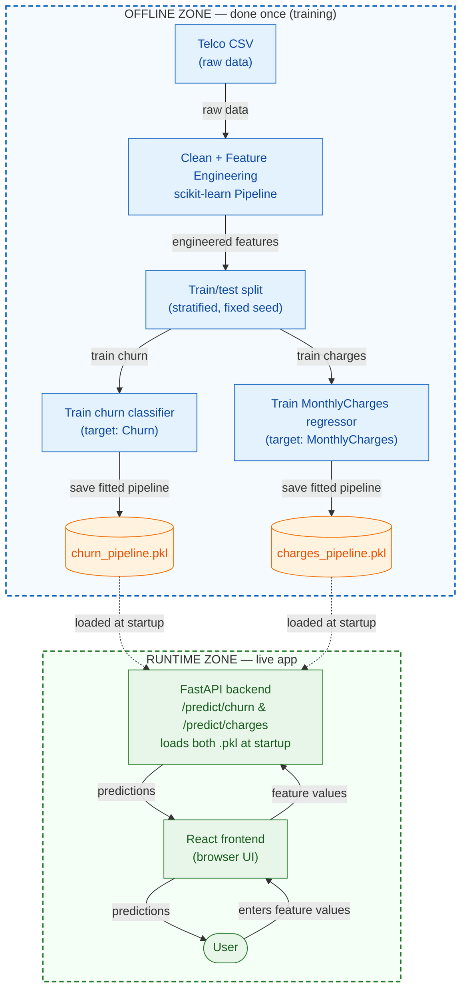

# ML App Architecture — Telco Customer Churn (Option A: train offline, deploy)

```mermaid
flowchart TB
  subgraph OFFLINE["OFFLINE ZONE — done once (training)"]
    direction TB
    CSV["Telco CSV<br/>(raw data)"]
    PIPE["Clean + Feature Engineering<br/>scikit-learn Pipeline"]
    SPLIT["Train/test split<br/>(stratified, fixed seed)"]
    TCHURN["Train churn classifier<br/>(target: Churn)"]
    TCHARGES["Train MonthlyCharges regressor<br/>(target: MonthlyCharges)"]
    PKL1[("churn_pipeline.pkl")]
    PKL2[("charges_pipeline.pkl")]

    CSV -->|raw data| PIPE
    PIPE -->|engineered features| SPLIT
    SPLIT -->|train churn| TCHURN
    SPLIT -->|train charges| TCHARGES
    TCHURN -->|save fitted pipeline| PKL1
    TCHARGES -->|save fitted pipeline| PKL2
  end

  subgraph RUNTIME["RUNTIME ZONE — live app"]
    direction TB
    USER(["User"])
    REACT["React frontend<br/>(browser UI)"]
    API["FastAPI backend<br/>/predict/churn &amp; /predict/charges<br/>loads both .pkl at startup"]

    USER -->|enters feature values| REACT
    REACT -->|feature values| API
    API -->|predictions| REACT
    REACT -->|predictions| USER
  end

  PKL1 -.->|loaded at startup| API
  PKL2 -.->|loaded at startup| API

  classDef offline fill:#E3F2FD,stroke:#1565C0,stroke-width:1px,color:#0D47A1;
  classDef runtime fill:#E8F5E9,stroke:#2E7D32,stroke-width:1px,color:#1B5E20;
  classDef artifact fill:#FFF3E0,stroke:#EF6C00,stroke-width:1px,color:#E65100;
  class CSV,PIPE,SPLIT,TCHURN,TCHARGES offline;
  class USER,REACT,API runtime;
  class PKL1,PKL2 artifact;
  style OFFLINE fill:#F5FAFF,stroke:#1565C0,stroke-width:2px,stroke-dasharray:6 4;
  style RUNTIME fill:#F4FFF6,stroke:#2E7D32,stroke-width:2px,stroke-dasharray:6 4;
```
